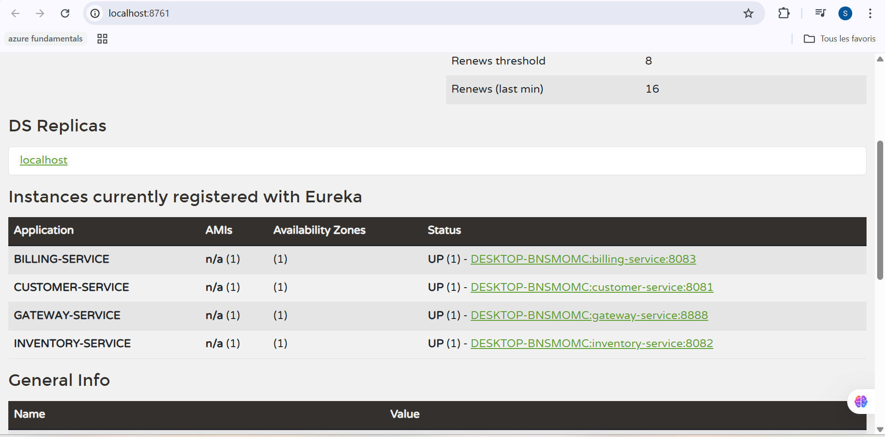
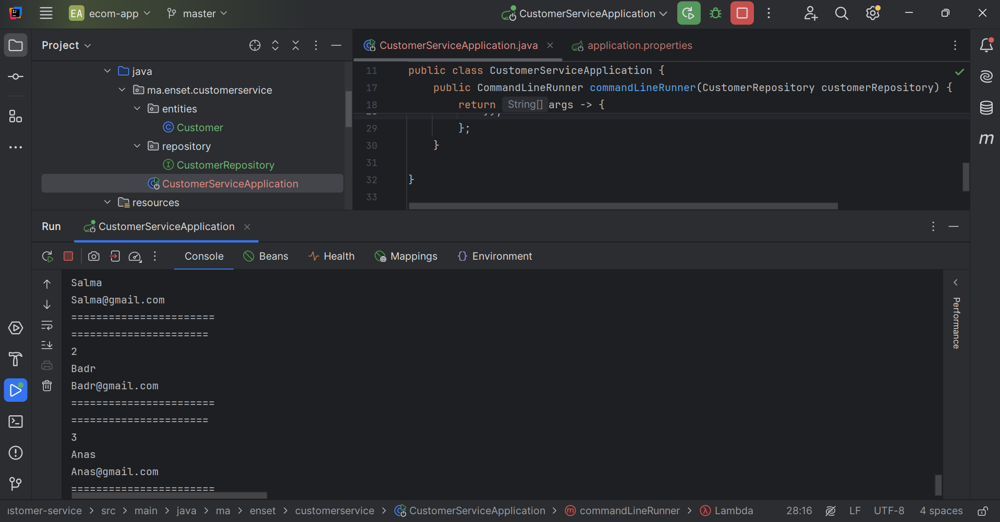
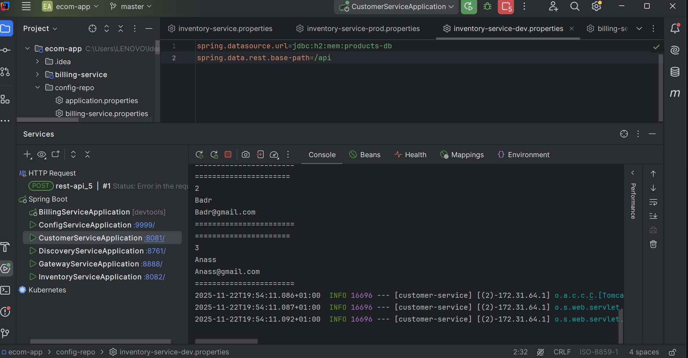
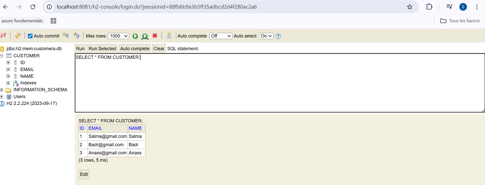
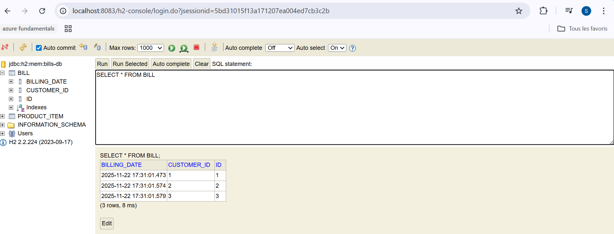
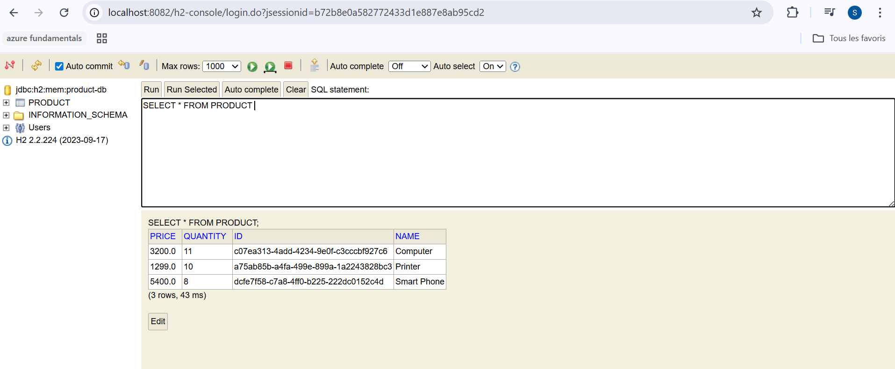
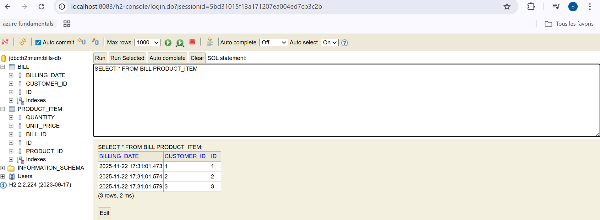
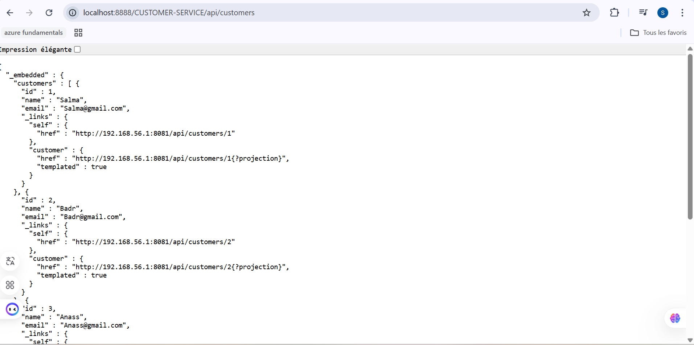
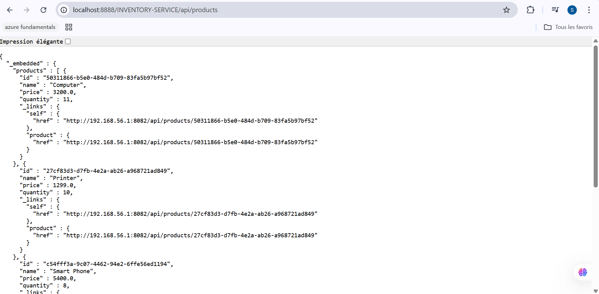
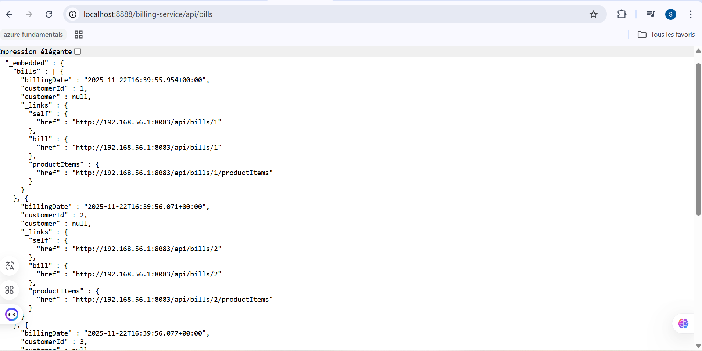

# Développement d’une Architecture Micro-services

##  Objectif du projet

L’objectif de cette activité pratique est de **concevoir et développer une application distribuée basée sur une architecture micro-services** permettant de :

- Gérer des **clients**
- Gérer des **produits**
- Gérer des **factures**
- Mettre en place une **gateway**
- Implémenter la **découverte de services**
- Utiliser la **configuration centralisée**
- Consommer les micro-services via un **client Angular**

---


*Figure 1 : Architecture Micro-services – Customer, Inventory, Billing, Gateway, Eureka, Config Service*

---

##  Technologies utilisées

### Backend
- Java 17
- Spring Boot
- Spring Cloud
    - Eureka Discovery Service
    - Spring Cloud Gateway
    - Open Feign
    - Spring Cloud Config
- Spring Data JPA
- H2 Database
- Lombok

### Frontend
- Angular
- Bootstrap

### Outils
- Maven
- Git & GitHub
- Postman


## Travail réalisé

### 1️⃣ Création du micro-service `customer-service`
- Gestion des clients
- Exposition d’API REST
- Base de données H2
- CRUD des clients

---

### 2️⃣ Création du micro-service `inventory-service`
- Gestion des produits
- CRUD des produits
- Exposition d’API REST

---

### 3️⃣ Mise en place de la Gateway (Spring Cloud Gateway)
- Centralisation des accès
- Routage des requêtes vers les micro-services

---

### 4️⃣ Configuration statique des routes
- Définition des routes dans `application.yml`
- Mapping URI → micro-services

---

### 5️⃣ Création de l’annuaire Eureka Discovery Service
- Enregistrement automatique des micro-services
- Découverte dynamique des services

#  Accès :
http://localhost:8761


---

### 6️⃣ Configuration dynamique des routes de la Gateway
- Intégration avec Eureka
- Routage dynamique basé sur le nom des services

---

### 7️⃣ Création du micro-service `billing-service`
- Gestion des factures
- Appels inter-services via **Open Feign**
- Association :
    - Client
    - Produits
    - Facture

---

### 8️⃣ Création du service de configuration centralisée
- Spring Cloud Config Server
- Centralisation des fichiers `application.yml`
- Chargement dynamique des configurations

### 9️⃣ Création du client Angular
- Interface utilisateur web
- Consommation des API REST via la Gateway
- Affichage :
    - Clients
    - Produits
    - Factures

---

##  Démarrage des services

Ordre recommandé :

```bash
1. discovery-service
2. config-service
3. customer-service
4. inventory-service
5. billing-service
6. gateway-service
7. angular-client
```











# Conclusion

Cette activité pratique a permis de :

Comprendre les principes des micro-services

Mettre en œuvre l’écosystème Spring Cloud

Construire une application distribuée, scalable et maintenable

Maîtriser la communication inter-services et le routage dynamique

# Réalisé par

Salma Fennan
